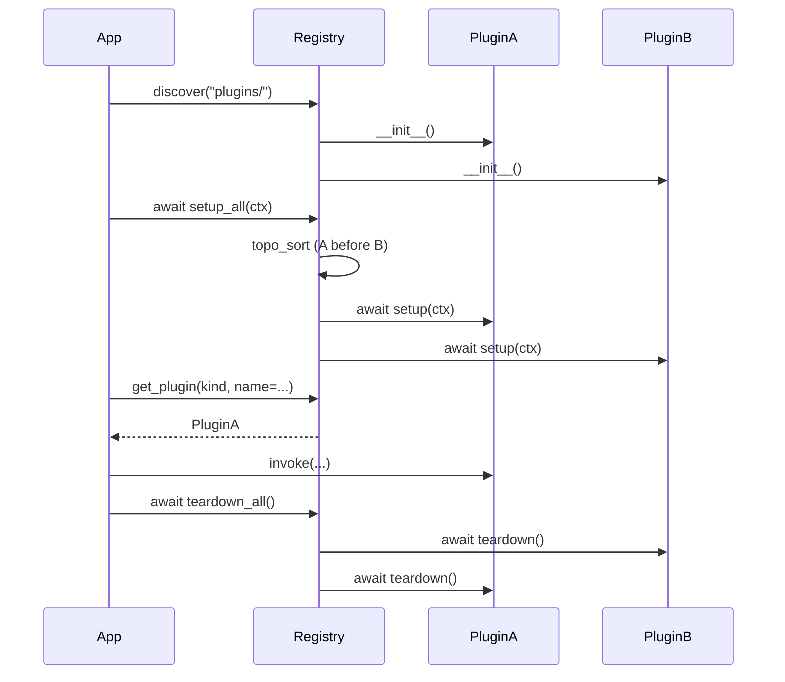

import Tabs from '@theme/Tabs';
import TabItem from '@theme/TabItem';

# Plugin lifecycle

A plugin moves through three phases over the lifetime of an application. Each phase has a clear contract and a set of guarantees that you can rely on when writing code.

## Phase 1. Registration

During the call to `discover(path)` the registry:

1. Walks the supplied directory.
2. Locates folders that contain a `dagstack.toml`.
3. Validates the manifest against the pydantic schema.
4. Imports the implementation module (Python: `plugin.py`; TypeScript: `plugin.ts`/`plugin.js`; Go: determined by the manifest).
5. Creates an instance of the plugin class via the **no-argument** constructor.
6. Stores the `(manifest, instance)` pair in the registry.

At this stage `setup` has not been called yet — the plugin exists as an object, but neither resources nor configuration have been delivered to it. The constructor body should be trivial: no file operations, no network connections, no heavy computation.

<Tabs groupId="lang" queryString="lang">
  <TabItem value="python" label="Python">
    ```python
    class MyPlugin:
        def __init__(self) -> None:
            # Correct: only initialise the fields that setup will populate.
            self._client = None
            self._config = None
    ```
  </TabItem>
  <TabItem value="typescript" label="TypeScript">
    ```ts
    import type { PluginContext } from "@dagstack/plugin-system";

    export class MyPlugin {
      private config!: Record<string, unknown>;
      private ready = false;

      async setup(ctx: PluginContext): Promise<void> {
        this.config = ctx.config;
        this.ready = true;
      }

      async teardown(): Promise<void> {
        this.ready = false;
      }
    }

    // Host orchestration:
    //   const registry = new PluginRegistry();
    //   await discover(registry, "plugins/");
    //   await registry.setupAll({ configs, resources });   // topo order by depends_on
    //   // ... use registry.getLoadedPlugins() with dispatchers ...
    //   await registry.teardownAll();                       // reverse order; aggregates TeardownErrors
    ```
  </TabItem>
  <TabItem value="go" label="Go">
    ```go
    // Correct: zero-value struct, initialisation happens in Setup.
    type MyPlugin struct {
        client *Client
        config *Config
    }
    ```
  </TabItem>
</Tabs>

## Phase 2. Initialisation

The registry's `setup_all()` method initialises **every** registered plugin:

1. The registry builds the dependency graph of the plugins (when declared in the manifest).
2. `topo_sort` determines the initialisation order — plugin A is initialised before B if B depends on A.
3. For every plugin in this order the registry calls `setup(context)`, where `context: PluginContext` contains:
   - `config` — the validated section of the plugin's configuration;
   - `resources` — the injected standard resources (`Clock`, `Rng`, `BlobStore`, `HttpClient` and the others from `STANDARD_RESOURCES`);
   - `tenant` — a `TenantContext` or a `NoOpTenantContext`;
   - `event_bus` — the publish/subscribe event bus;
   - `logger` — the structured logger from `dagstack/logger-spec`.

Inside `setup` a plugin should:
- Create clients (HTTP, database), open connections.
- Read the configuration, store the values it needs.
- Subscribe to configuration changes (when reactivity is required).
- Register additional resources for dependent plugins.

**Forbidden**: business-logic calls (handling input data, sending user requests). `setup` is preparation only.

<Tabs groupId="lang" queryString="lang">
  <TabItem value="python" label="Python">
    ```python
    class MyPlugin:
        async def setup(self, context: PluginContext) -> None:
            self._config = context.config
            # Resources are injected at setup time and exposed as attributes
            # on the per-plugin `ResourceContainer` (`ctx.resources`); the
            # async `await ctx.resources.get(name)` form is also available.
            self._http = context.resources.http_client
            self._clock = context.resources.clock
            self._client = MyClient(
                base_url=self._config["base_url"],
                http=self._http,
            )
    ```
    :::info Phase 2 scope
    Live config-section subscriptions (`on_section_change`) are part of the Phase 2 `dagstack/config-spec` integration. In `0.1.0-rc.2` config is delivered once during `setup`.
    :::
  </TabItem>
  <TabItem value="typescript" label="TypeScript">
    ```ts
    import type { PluginContext } from "@dagstack/plugin-system";

    export class MyPlugin {
      private config!: Record<string, unknown>;
      private ready = false;

      async setup(ctx: PluginContext): Promise<void> {
        this.config = ctx.config;
        this.ready = true;
      }

      async teardown(): Promise<void> {
        this.ready = false;
      }
    }

    // Host orchestration:
    //   const registry = new PluginRegistry();
    //   await discover(registry, "plugins/");
    //   await registry.setupAll({ configs, resources });   // topo order by depends_on
    //   // ... use registry.getLoadedPlugins() with dispatchers ...
    //   await registry.teardownAll();                       // reverse order; aggregates TeardownErrors
    ```
  </TabItem>
  <TabItem value="go" label="Go">
    ```go
    import (
        "context"
        "encoding/json"

        pluginsystem "go.dagstack.dev/plugin-system"
    )

    func (p *MyPlugin) Setup(ctx context.Context, pluginCtx *pluginsystem.PluginContext) error {
        // Decode the validated config section.
        raw, err := json.Marshal(pluginCtx.Config)
        if err != nil {
            return err
        }
        if err := json.Unmarshal(raw, &p.config); err != nil {
            return err
        }
        // Resolve resources by name; the user-side type assertion is required.
        rawHTTP, err := pluginCtx.Resources.Get("http_client")
        if err != nil {
            return err
        }
        p.http = rawHTTP.(HTTPClient)

        rawClock, err := pluginCtx.Resources.Get("clock")
        if err != nil {
            return err
        }
        p.clock = rawClock.(Clock)

        p.client = NewMyClient(p.config.BaseURL, p.http)
        return nil
    }
    ```
    :::info Live config-section subscriptions are Phase 2
    The Go binding receives `Config` once during `Setup`. Subscriptions to live updates land alongside the `dagstack/config-spec` integration in Phase 2.
    :::
  </TabItem>
</Tabs>

## Phase 3. Teardown

The registry's `teardown_all()` method runs the closing cycle:

1. It calls `teardown()` on every plugin **in the reverse of the initialisation order**.
2. If a plugin's `teardown` raises, the exception **does not abort** the loop — exceptions are collected into `TeardownErrors`.
3. After every `teardown` has run, the aggregated error (if any) is propagated upwards.

`teardown` should:
- Close connections (HTTP clients, sockets, file descriptors).
- Cancel subscriptions to configuration and events.
- Release injected resources that the plugin created itself (when applicable).

<Tabs groupId="lang" queryString="lang">
  <TabItem value="python" label="Python">
    ```python
    async def teardown(self) -> None:
        if self._client:
            self._client.close()
    ```
  </TabItem>
  <TabItem value="typescript" label="TypeScript">
    ```ts
    import type { PluginContext } from "@dagstack/plugin-system";

    export class MyPlugin {
      private config!: Record<string, unknown>;
      private ready = false;

      async setup(ctx: PluginContext): Promise<void> {
        this.config = ctx.config;
        this.ready = true;
      }

      async teardown(): Promise<void> {
        this.ready = false;
      }
    }

    // Host orchestration:
    //   const registry = new PluginRegistry();
    //   await discover(registry, "plugins/");
    //   await registry.setupAll({ configs, resources });   // topo order by depends_on
    //   // ... use registry.getLoadedPlugins() with dispatchers ...
    //   await registry.teardownAll();                       // reverse order; aggregates TeardownErrors
    ```
  </TabItem>
  <TabItem value="go" label="Go">
    ```go
    func (p *MyPlugin) Teardown(ctx context.Context) error {
        if p.client != nil {
            return p.client.Close()
        }
        return nil
    }
    ```
  </TabItem>
</Tabs>

## Inter-plugin dependencies

A plugin may explicitly declare that it depends on another plugin. The registry takes that into account during `topo_sort`.

```toml title="plugins/reranker/dagstack.toml"
[plugin]
name = "cross-encoder"
kind = "reranker"
runtime = "in_process"
core_version = ">=0.1.0,<1.0.0"

[[plugin.depends_on]]
kind = "embedder"
name = "openai_compatible"
```

Once that is in place, `embedder.openai_compatible` is initialised **before** `reranker.cross-encoder`. The dependent plugin can be retrieved via `context.registry`:

<Tabs groupId="lang" queryString="lang">
  <TabItem value="python" label="Python">
    ```python
    async def setup(self, context: PluginContext) -> None:
        self._embedder = context.registry.get_plugin(
            "embedder", name="openai_compatible",
        )
    ```
  </TabItem>
  <TabItem value="typescript" label="TypeScript">
    ```ts
    import type { PluginContext } from "@dagstack/plugin-system";

    export class MyPlugin {
      private config!: Record<string, unknown>;
      private ready = false;

      async setup(ctx: PluginContext): Promise<void> {
        this.config = ctx.config;
        this.ready = true;
      }

      async teardown(): Promise<void> {
        this.ready = false;
      }
    }

    // Host orchestration:
    //   const registry = new PluginRegistry();
    //   await discover(registry, "plugins/");
    //   await registry.setupAll({ configs, resources });   // topo order by depends_on
    //   // ... use registry.getLoadedPlugins() with dispatchers ...
    //   await registry.teardownAll();                       // reverse order; aggregates TeardownErrors
    ```
  </TabItem>
  <TabItem value="go" label="Go">
    ```go
    func (p *Reranker) Setup(ctx context.Context, pluginCtx *pluginsystem.PluginContext) error {
        disp := pluginsystem.NewDispatchSingleton[Embedder](pluginCtx.Registry, "embedder")
        embedder, err := disp.Resolve()
        if err != nil {
            return err
        }
        p.embedder = embedder
        return nil
    }
    ```
  </TabItem>
</Tabs>

A cycle in the dependency graph causes a `DependencyCycle` error during `setup_all()`.

## Partial failure

If `setup` of one plugin throws an exception:

1. The registry catches the exception.
2. It calls `teardown` on every plugin already initialised (in reverse order).
3. It propagates the original exception upwards.

This guarantees that a partially initialised registry is never left in a dangling state. From the user's point of view: `setup_all()` either completes successfully as a whole or it raises an exception and leaves the registry in the pre-initialisation state.

## Sequence diagram



## See also

- [Plugin registry](../concepts/registry) — a deeper model of errors and invariants.
- [Writing a plugin](./writing-a-plugin) — a hands-on example with `setup`/`teardown`.
