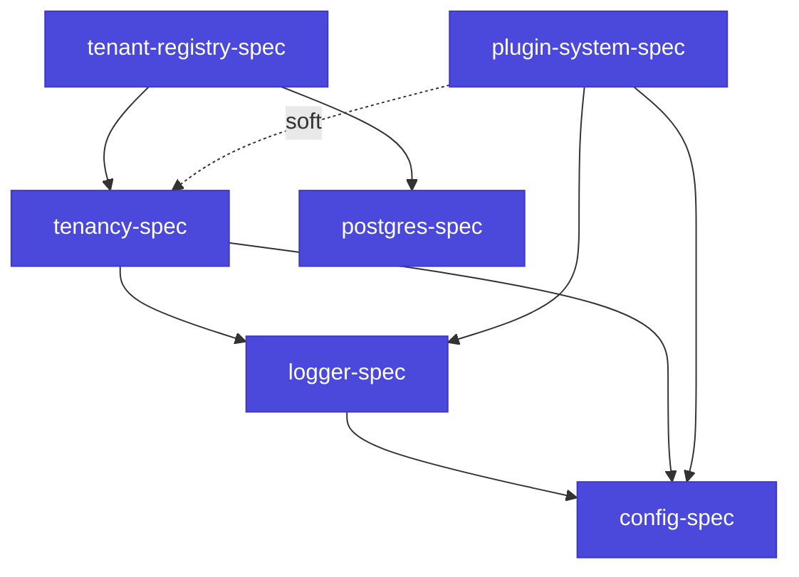

# Relationships with other dagstack specs

`dagstack/plugin-system` is the bottom infrastructure layer of the ecosystem. More specialised products sit on top of it: the config stack, logging, the multi-tenant model, common database patterns. This page is a map of how plugin-system interacts with each of them, which abstractions are reused and where the boundaries of responsibility lie.

## Summary table

| Spec | Role for plugin-system | Strength of the dependency |
|---|---|---|
| [`config-spec`](https://github.com/dagstack/config-spec) | Source of plugin configs, with the `<kind>.<name>` section, plus hot-reload. | **Hard** — every plugin reads its own config through the config stack. |
| [`logger-spec`](https://github.com/dagstack/logger-spec) | `PluginContext.logger` implements the logger interface; trace correlation. | **Hard** — built into `PluginContext`. |
| [`tenancy-spec`](https://github.com/dagstack/tenancy-spec) | `TenantContext` lives in `PluginContext.tenant`; governance middleware uses it for filtering. | **Soft** — plugin-system guarantees a slot in `PluginContext.metadata`, but does not implement the tenancy model itself. |
| [`tenant-registry-spec`](https://github.com/dagstack/tenant-registry-spec) | Not a direct dependency of plugin-system; many plugins use the tenant registry for per-tenant state. | **Nil** for the core; optional for plugins. |
| [`postgres-spec`](https://github.com/dagstack/postgres-spec) | Common database patterns that plugins with state (checkpoint store, chunks, embeddings) rely on. | **Nil** for the core; optional for plugins. |

**Hard** — the plugin-system core MUST be able to work with this spec. **Soft** — plugin-system provides the slot; the implementation lives in the higher-level product. **Nil** — does not concern plugin-system; used by plugins on an optional basis.

## Relationship with `config-spec`

Every plugin declares a config section with the name `<kind>.<name>` (see [Guide: Plugin configuration](/docs/guides/configuration)). The plugin-system core delegates reading of this section to the config stack — it does not load YAML directly.

**Connection points**:

- `PluginContext.config` — an instance of the plugin's config class (pydantic in Python, zod in TypeScript, struct in Go), already validated by the config-spec machinery.
- `context.on_section_change(callback)` — subscription to changes of the plugin's own section; implemented via `ConfigSource.watch()` from config-spec ([ADR-0001 config-spec §7.2](https://github.com/dagstack/config-spec/tree/main/adr)).
- The canonical names of secret-bearing fields (`api_key`, `password`, `_secret`, `_token`) are defined in [`config-spec/_meta/secret_patterns.yaml`](https://github.com/dagstack/config-spec/tree/main/_meta) — plugin-system uses this list when printing plugin configs in diagnostics, so that secrets are not logged.
- The canonical JSON used for inter-process transport of plugin manifests and configs (over `mcp_stdio`/`mcp_http`) is defined in `config-spec/_meta/canonical_json.yaml`; plugin-system uses it for serialisation at the transport boundary.

**Boundaries**:

- Plugin-system **does not implement** the config layering (`app-config.yaml` → `app-config.${ENV}.yaml` → environment variables) — that is the config stack's job.
- Plugin-system **does not validate** a plugin's config itself — that is done by the config stack against the pydantic / zod schema declared by the plugin in `config_schema`.

## Relationship with `logger-spec`

`PluginContext.logger` is a structured logger that implements the logger-spec interface. The semantic conventions (field names, timestamp format, severity levels) are pinned normatively by logger-spec.

**Connection points**:

- `context.logger` — a structured logger with prepopulated fields: `plugin.name`, `plugin.kind`, `plugin.version`, `trace_id`, `tenant_id` (when present in `metadata`).
- Trace correlation — the logger automatically picks up `trace_id` and `span_id` from `PluginContext.metadata["trace_context"]` (see [ADR-0005](./adr/0005-horizontal-hooks) §5).
- OpenTelemetry compatibility — logger-spec uses OTel field names (`time_unix_nano`, `trace_id`, `severity_text` / `severity_number`); plugin-system does not override them.

**Boundaries**:

- Plugin-system **does not decide** the log backend (stdout / syslog / OTLP) — that is logger-stack configuration.
- Plugin-system **does not emit** spans itself — observability middleware (delivered via the horizontal-extensions mechanism) wraps every hook call in a span automatically.

## Relationship with `tenancy-spec`

Plugin-system guarantees a slot in `PluginContext` for the tenant context, but the tenancy model itself (how tenants are organised, how operations are authorised, how isolation works) is defined by tenancy-spec.

**Connection points**:

- `PluginContext.tenant` — a `TenantContext` instance (or `NoOpTenantContext` if the application is single-tenant). The type and the interface of `TenantContext` come from tenancy-spec.
- `PluginContext.metadata["tenant_id"]` — the serialisable identifier of the tenant, propagated over the MCP wire (a live `TenantContext` is not serialised; only the ID travels through metadata).
- `TenantAccessDenied` — the standard error raised by governance middleware and / or plugins when access is denied; the type comes from tenancy-spec.

**Boundaries**:

- Plugin-system **does not implement** tenancy policy (who has access, how to authorise) — that is the job of governance middleware delivered by higher-level products.
- Plugin-system **does not manage** tenant lifecycle (creation, deletion, quota) — that is the tenant registry's job.
- However, plugin-system **MUST** guarantee that `metadata["tenant_id"]` is propagated correctly through all three runtime adapters (`in_process`, `mcp_stdio`, `mcp_http`), so that out-of-process plugins receive the same tenant context.

## Relationship with `tenant-registry-spec`

The plugin-system core **does not depend** on tenant-registry. However, many plugins use the tenant registry to store per-tenant state (quota counters, feature flags, settings).

**Typical pattern**:

- The plugin declares `tenant_registry` under `resources.optional`.
- In `setup()` it obtains a `TenantRegistry` via `context.resources.tenant_registry`.
- It reads and writes per-tenant state through that interface.

The `TenantRegistry` interface comes from tenant-registry-spec, not from plugin-system.

## Relationship with `postgres-spec`

The plugin-system core **does not depend** on postgres-spec. However:

- The built-in `CheckpointStore` implementation for Phase 1+ (`PostgresCheckpointStore`) follows postgres-spec patterns: migrations, transactions with retry, and hybrid TTL + LISTEN/NOTIFY invalidation.
- Plugins with state (indexers, RAG pipelines) MAY use postgres-spec resources (`postgres` under `resources.optional`).

## Reusable abstractions

Some abstractions are defined in one spec and reused by all the others:

| Abstraction | Source | Reused in |
|---|---|---|
| Canonical JSON | `config-spec/_meta/canonical_json.yaml` | plugin-system (MCP wire), tenancy, tenant-registry |
| Secret patterns | `config-spec/_meta/secret_patterns.yaml` | plugin-system (diagnostic output), logger (masking) |
| W3C Trace Context formatting | `logger-spec` | plugin-system (`metadata["trace_context"]`), tenancy, tenant-registry |
| OTel field-names convention | `logger-spec` | every spec that has structured logs |
| SQLSTATE error codes | `postgres-spec` | tenant-registry, any plugin with postgres resources |

This set is **revisited** whenever a new spec appears: if the new spec wants to extend the table, it raises a PR against the corresponding source spec.

## Spec dependency graph

The "plugin-system → tenancy" arrow is dashed (`soft`) because plugin-system also works without the tenancy add-on; the slot is there, but providing an implementation is optional.

## The normative source for each spec

- [`dagstack/plugin-system-spec`](https://github.com/dagstack/plugin-system-spec) — this spec.
- [`dagstack/config-spec`](https://github.com/dagstack/config-spec) — the hierarchical config stack with substitutions, sources and hot-reload.
- [`dagstack/logger-spec`](https://github.com/dagstack/logger-spec) — OTel-compatible structured logging.
- [`dagstack/tenancy-spec`](https://github.com/dagstack/tenancy-spec) — the multi-tenant model, `TenantContext` and isolation.
- [`dagstack/tenant-registry-spec`](https://github.com/dagstack/tenant-registry-spec) — SQL-backed tenant registries.
- [`dagstack/postgres-spec`](https://github.com/dagstack/postgres-spec) — common patterns for working with PostgreSQL.

Each spec lives in its own repository and evolves independently; changes to shared abstractions are coordinated via PRs to the source spec.
