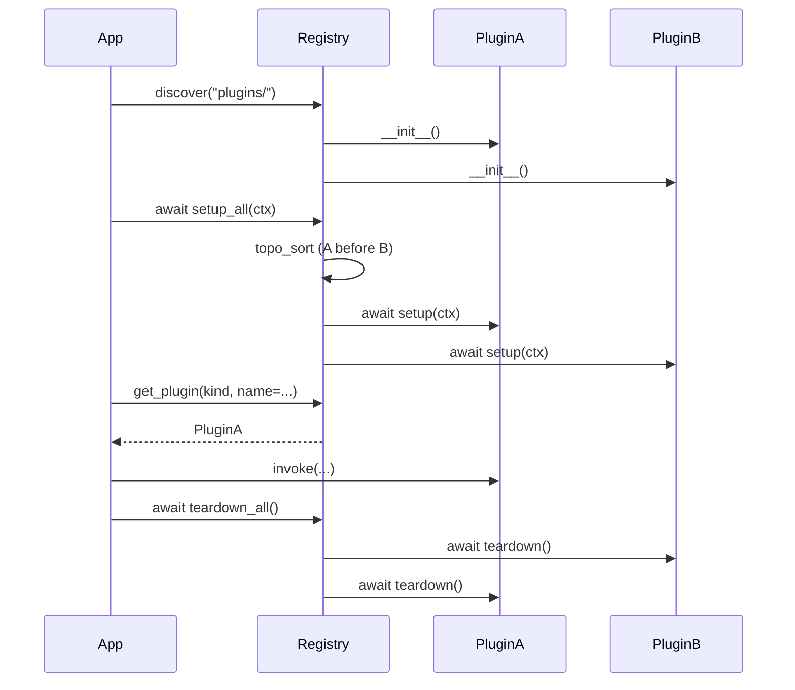

import Tabs from '@theme/Tabs';
import TabItem from '@theme/TabItem';

# Жизненный цикл плагина

Плагин проходит через три фазы в процессе жизни приложения. Каждая фаза имеет чёткий контракт и набор гарантий, на которые можно опереться при написании кода.

## Фаза 1. Регистрация

Во время выполнения `discover(path)` реестр:

1. Обходит указанный каталог.
2. Находит папки с `dagstack.toml`.
3. Валидирует манифест по pydantic-схеме.
4. Импортирует модуль реализации (Python: `plugin.py`; TypeScript: `plugin.ts`/`plugin.js`; Go: определяется манифестом).
5. Создаёт экземпляр класса плагина через конструктор **без аргументов**.
6. Сохраняет пару `(manifest, instance)` в реестре.

На этом этапе `setup` ещё не вызывался — плагин существует как объект, но ни ресурсы, ни конфиг ему не переданы. Код конструктора должен быть тривиальным: никаких файловых операций, сетевых подключений, тяжёлых вычислений.

<Tabs groupId="lang" queryString="lang">
  <TabItem value="python" label="Python">
    ```python
    class MyPlugin:
        def __init__(self) -> None:
            # Correct: only initialise the fields that setup will populate.
            self._client = None
            self._config = None
    ```
  </TabItem>
  <TabItem value="typescript" label="TypeScript">
    ```ts
    import { PluginRegistry, discover, SingletonDispatcher } from "@dagstack/plugin-system";

    const registry = new PluginRegistry();
    await discover(registry, "plugins/");
    await registry.setupAll();

    // Используйте registry.getLoadedPlugins() с любым из пяти диспетчеров
    // (singleton / broadcast_collect / broadcast_notify / chain / capability) —
    // см. [руководства по диспетчерам](/ru/docs/guides/dispatchers/singleton).

    await registry.teardownAll();
    ```

    Полные snippet'ы под конкретные API — на соответствующих EN-страницах концептов, гайдов и спецификации.
  </TabItem>
  <TabItem value="go" label="Go">
    ```go
    // Correct: zero-value struct, initialisation happens in Setup.
    type MyPlugin struct {
        client *Client
        config *Config
    }
    ```
  </TabItem>
</Tabs>

## Фаза 2. Инициализация

Метод `setup_all()` реестра запускает инициализацию **всех** зарегистрированных плагинов:

1. Реестр строит граф зависимостей плагинов (если они объявлены в манифесте).
2. `topo_sort` определяет порядок инициализации — плагин A инициализируется до B, если B зависит от A.
3. Для каждого плагина в этом порядке реестр вызывает `setup(context)`, где `context: PluginContext` содержит:
   - `config` — валидированная секция конфига плагина;
   - `resources` — инъектированные стандартные ресурсы (`Clock`, `Rng`, `BlobStore`, `HttpClient` и прочие из `STANDARD_RESOURCES`);
   - `tenant` — `TenantContext` или `NoOpTenantContext`;
   - `event_bus` — шина событий для publish/subscribe;
   - `logger` — структурированный логгер из `dagstack/logger-spec`.

Внутри `setup` плагин должен:
- Создать клиентов (HTTP, база данных), открыть соединения.
- Прочитать конфиг, сохранить нужные значения.
- Подписаться на изменения конфига (если нужна реактивность).
- Зарегистрировать дополнительные ресурсы для зависимых плагинов.

**Запрещено**: делать вызовы бизнес-логики (обрабатывать входные данные, отправлять запросы пользователей). `setup` — только подготовка.

<Tabs groupId="lang" queryString="lang">
  <TabItem value="python" label="Python">
    ```python
    class MyPlugin:
        async def setup(self, context: PluginContext) -> None:
            self._config = context.config
            # Resources are injected at setup time and exposed as attributes
            # on the per-plugin `ResourceContainer` (`ctx.resources`); the
            # async `await ctx.resources.get(name)` form is also available.
            self._http = context.resources.http_client
            self._clock = context.resources.clock
            self._client = MyClient(
                base_url=self._config["base_url"],
                http=self._http,
            )
    ```
    :::info Phase 2 scope
    Live config-section subscriptions (`on_section_change`) are part of the Phase 2 `dagstack/config-spec` integration. In `0.1.0-rc.2` config is delivered once during `setup`.
    :::
  </TabItem>
  <TabItem value="typescript" label="TypeScript">
    ```ts
    import { PluginRegistry, discover, SingletonDispatcher } from "@dagstack/plugin-system";

    const registry = new PluginRegistry();
    await discover(registry, "plugins/");
    await registry.setupAll();

    // Используйте registry.getLoadedPlugins() с любым из пяти диспетчеров
    // (singleton / broadcast_collect / broadcast_notify / chain / capability) —
    // см. [руководства по диспетчерам](/ru/docs/guides/dispatchers/singleton).

    await registry.teardownAll();
    ```

    Полные snippet'ы под конкретные API — на соответствующих EN-страницах концептов, гайдов и спецификации.
  </TabItem>
  <TabItem value="go" label="Go">
    ```go
    import (
        "context"
        "encoding/json"

        pluginsystem "go.dagstack.dev/plugin-system"
    )

    func (p *MyPlugin) Setup(ctx context.Context, pluginCtx *pluginsystem.PluginContext) error {
        // Decode the validated config section.
        raw, err := json.Marshal(pluginCtx.Config)
        if err != nil {
            return err
        }
        if err := json.Unmarshal(raw, &p.config); err != nil {
            return err
        }
        // Resolve resources by name; the user-side type assertion is required.
        rawHTTP, err := pluginCtx.Resources.Get("http_client")
        if err != nil {
            return err
        }
        p.http = rawHTTP.(HTTPClient)

        rawClock, err := pluginCtx.Resources.Get("clock")
        if err != nil {
            return err
        }
        p.clock = rawClock.(Clock)

        p.client = NewMyClient(p.config.BaseURL, p.http)
        return nil
    }
    ```
    :::info Live config-section subscriptions are Phase 2
    The Go binding receives `Config` once during `Setup`. Subscriptions to live updates land alongside the `dagstack/config-spec` integration in Phase 2.
    :::
  </TabItem>
</Tabs>

## Фаза 3. Завершение

Метод `teardown_all()` реестра выполняет завершающий цикл:

1. Вызывает `teardown()` у каждого плагина **в порядке, обратном порядку инициализации**.
2. Если `teardown` какого-то плагина выбрасывает исключение, оно **не прерывает** цикл — исключения собираются в `TeardownErrors`.
3. После завершения всех `teardown` агрегированная ошибка (если были) пробрасывается наверх.

`teardown` должен:
- Закрыть соединения (HTTP-клиенты, сокеты, файловые дескрипторы).
- Отменить подписки на конфиг/события.
- Освободить инъектированные ресурсы, которые плагин создал сам (если такие есть).

<Tabs groupId="lang" queryString="lang">
  <TabItem value="python" label="Python">
    ```python
    async def teardown(self) -> None:
        if self._client:
            self._client.close()
    ```
  </TabItem>
  <TabItem value="typescript" label="TypeScript">
    ```ts
    import { PluginRegistry, discover, SingletonDispatcher } from "@dagstack/plugin-system";

    const registry = new PluginRegistry();
    await discover(registry, "plugins/");
    await registry.setupAll();

    // Используйте registry.getLoadedPlugins() с любым из пяти диспетчеров
    // (singleton / broadcast_collect / broadcast_notify / chain / capability) —
    // см. [руководства по диспетчерам](/ru/docs/guides/dispatchers/singleton).

    await registry.teardownAll();
    ```

    Полные snippet'ы под конкретные API — на соответствующих EN-страницах концептов, гайдов и спецификации.
  </TabItem>
  <TabItem value="go" label="Go">
    ```go
    func (p *MyPlugin) Teardown(ctx context.Context) error {
        if p.client != nil {
            return p.client.Close()
        }
        return nil
    }
    ```
  </TabItem>
</Tabs>

## Зависимости между плагинами

Плагин может явно объявить, что он зависит от другого плагина. Реестр учтёт это при `topo_sort`.

```toml title="plugins/reranker/dagstack.toml"
[plugin]
name = "cross-encoder"
kind = "reranker"
runtime = "in_process"
core_version = ">=0.1.0,<1.0.0"

[[plugin.depends_on]]
kind = "embedder"
name = "openai_compatible"
```

После этого `embedder.openai_compatible` инициализируется **до** `reranker.cross-encoder`. Получить зависимый плагин можно через `context.registry`:

<Tabs groupId="lang" queryString="lang">
  <TabItem value="python" label="Python">
    ```python
    async def setup(self, context: PluginContext) -> None:
        self._embedder = context.registry.get_plugin(
            "embedder", name="openai_compatible",
        )
    ```
  </TabItem>
  <TabItem value="typescript" label="TypeScript">
    ```ts
    import { PluginRegistry, discover, SingletonDispatcher } from "@dagstack/plugin-system";

    const registry = new PluginRegistry();
    await discover(registry, "plugins/");
    await registry.setupAll();

    // Используйте registry.getLoadedPlugins() с любым из пяти диспетчеров
    // (singleton / broadcast_collect / broadcast_notify / chain / capability) —
    // см. [руководства по диспетчерам](/ru/docs/guides/dispatchers/singleton).

    await registry.teardownAll();
    ```

    Полные snippet'ы под конкретные API — на соответствующих EN-страницах концептов, гайдов и спецификации.
  </TabItem>
  <TabItem value="go" label="Go">
    ```go
    func (p *Reranker) Setup(ctx context.Context, pluginCtx *pluginsystem.PluginContext) error {
        disp := pluginsystem.NewDispatchSingleton[Embedder](pluginCtx.Registry, "embedder")
        embedder, err := disp.Resolve()
        if err != nil {
            return err
        }
        p.embedder = embedder
        return nil
    }
    ```
  </TabItem>
</Tabs>

Цикл в зависимостях — ошибка `DependencyCycle` на этапе `setup_all()`.

## Partial failure

Если `setup` одного плагина выбросил исключение:

1. Реестр перехватывает исключение.
2. Вызывает `teardown` у всех уже инициализированных плагинов (в обратном порядке).
3. Пробрасывает исходное исключение наверх.

Это гарантирует, что частично инициализированный реестр не остаётся в висячем состоянии. Для пользовательского кода: `setup_all()` либо завершается успешно целиком, либо бросает исключение и оставляет реестр в состоянии «до инициализации».

## Диаграмма последовательности



## См. также

- [Реестр плагинов](../concepts/registry) — более глубокая модель ошибок и инвариантов.
- [Как написать плагин](./writing-a-plugin) — практический пример с `setup`/`teardown`.
