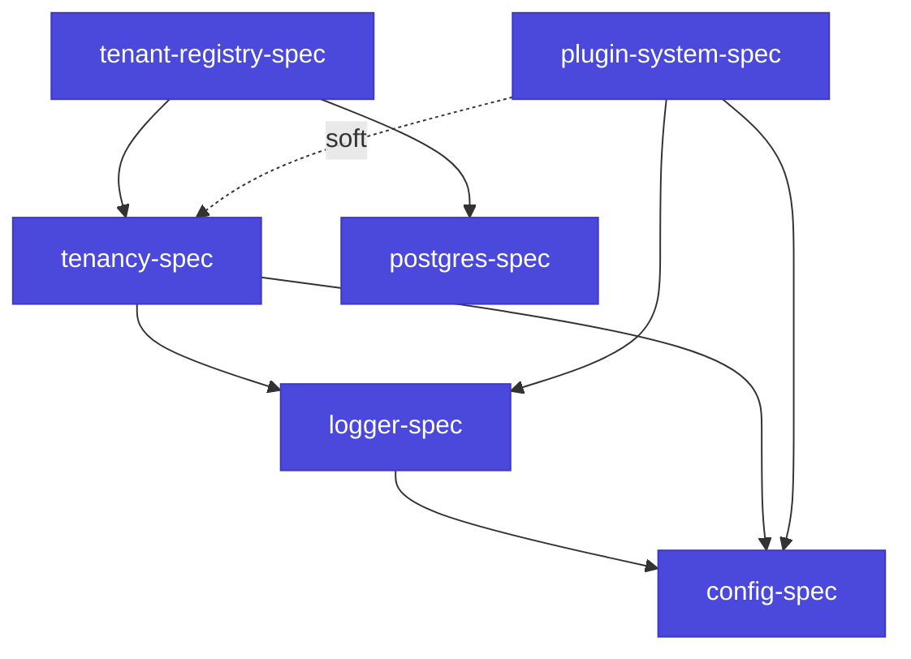

# Связи с другими спеками dagstack

`dagstack/plugin-system` — нижний инфраструктурный слой экосистемы. Поверх него стоят более специализированные продукты: конфиг-стек, логирование, мульти-клиентная модель, общие паттерны работы с БД. Эта страница — карта, как plugin-system взаимодействует с каждым из них, какие абстракции переиспользуются и где проходят границы ответственности.

## Обзорная таблица

| Спек | Роль для plugin-system | Степень зависимости |
|---|---|---|
| [`config-spec`](https://github.com/dagstack/config-spec) | Источник конфигов плагинов, секция `<kind>.<name>`; hot-reload. | **Hard** — каждый плагин читает свой конфиг через config-stack. |
| [`logger-spec`](https://github.com/dagstack/logger-spec) | `PluginContext.logger` реализует logger-интерфейс; trace correlation. | **Hard** — встроено в `PluginContext`. |
| [`tenancy-spec`](https://github.com/dagstack/tenancy-spec) | `TenantContext` в `PluginContext.tenant`; governance-middleware использует его для фильтрации. | **Soft** — plugin-system гарантирует слот в `PluginContext.metadata`, но не реализует tenancy-модель. |
| [`tenant-registry-spec`](https://github.com/dagstack/tenant-registry-spec) | Не прямая зависимость plugin-system; многие плагины используют tenant-registry для per-tenant состояния. | **Nil** для ядра; опционально для плагинов. |
| [`postgres-spec`](https://github.com/dagstack/postgres-spec) | Общие паттерны работы с БД, на которые опираются плагины со state (checkpoint-store, chunks, embeddings). | **Nil** для ядра; опционально для плагинов. |

**Hard** — plugin-system ядро обязано уметь работать с этим спеком. **Soft** — plugin-system даёт слот, реализация — на стороне надстроечного продукта. **Nil** — не касается plugin-system; используется плагинами опционально.

## Связь с `config-spec`

Каждый плагин объявляет секцию конфига именем `<kind>.<name>` (см. [Руководство: Конфигурация плагинов](/docs/guides/configuration)). Plugin-system ядро делегирует чтение этой секции config-stack — не загружает YAML напрямую.

**Точки соединения**:

- `PluginContext.config` — экземпляр класса конфига плагина (pydantic в Python, zod в TS, struct в Go), уже валидированный config-spec-механизмом.
- `context.on_section_change(callback)` — подписка на изменения своей секции; реализуется через `ConfigSource.watch()` из config-spec ([ADR-0001 config-spec §7.2](https://github.com/dagstack/config-spec/tree/main/adr)).
- Канонические имена секретных полей (`api_key`, `password`, `_secret`, `_token`) определены в [`config-spec/_meta/secret_patterns.yaml`](https://github.com/dagstack/config-spec/tree/main/_meta) — plugin-system использует этот список при печати конфигов плагинов в диагностике, чтобы не логировать секреты.
- Canonical JSON для межпроцессной передачи манифеста и конфига плагина (через `mcp_stdio`/`mcp_http`) — определён в `config-spec/_meta/canonical_json.yaml`; plugin-system использует его для сериализации на границе транспорта.

**Границы**:

- Plugin-system **не реализует** слои конфига (`app-config.yaml` → `app-config.${ENV}.yaml` → env-variables) — это задача config-stack.
- Plugin-system **не валидирует** конфиг плагина сам — это делает config-stack через pydantic/zod-схему, объявленную плагином в `config_schema`.

## Связь с `logger-spec`

`PluginContext.logger` — это структурированный логгер, реализующий интерфейс logger-spec. Семантические соглашения (имена полей, формат timestamp, severity-уровни) — нормативно зафиксированы в logger-spec.

**Точки соединения**:

- `context.logger` — структурированный логгер с prepopulated-полями: `plugin.name`, `plugin.kind`, `plugin.version`, `trace_id`, `tenant_id` (если присутствует в `metadata`).
- Trace-correlation — logger автоматически включает `trace_id` и `span_id` из `PluginContext.metadata["trace_context"]` (см. [ADR-0005](./adr/0005-horizontal-hooks) §5).
- OpenTelemetry совместимость — logger-spec использует OTel field-names (`time_unix_nano`, `trace_id`, `severity_text`/`severity_number`); plugin-system не переопределяет их.

**Границы**:

- Plugin-system **не определяет** backend для логов (stdout / syslog / OTLP) — это конфигурация logger-stack.
- Plugin-system **не делает** spans сам — observability-middleware (через механизм горизонтальных расширений) делает spans вокруг каждого hook-вызова автоматически.

## Связь с `tenancy-spec`

Plugin-system гарантирует слот в `PluginContext` для tenant-контекста, но саму модель tenancy (как устроены tenants, как разрешать операции, как их изолировать) определяет tenancy-spec.

**Точки соединения**:

- `PluginContext.tenant` — экземпляр `TenantContext` (или `NoOpTenantContext`, если приложение одно-клиентное). Тип и интерфейс `TenantContext` — из tenancy-spec.
- `PluginContext.metadata["tenant_id"]` — сериализуемый идентификатор tenant, пробрасываемый через MCP-wire (live `TenantContext` не сериализуется; через metadata передаётся только ID).
- `TenantAccessDenied` — стандартная ошибка, выбрасываемая governance-middleware и/или плагинами при отказе в доступе; тип из tenancy-spec.

**Границы**:

- Plugin-system **не реализует** tenancy-политику (кто имеет доступ, как разрешать) — это задача governance-middleware из надстроечных продуктов.
- Plugin-system **не управляет** lifecycle tenant (создание, удаление, quota) — это задача tenant-registry.
- Но plugin-system **обязан** гарантировать: `metadata["tenant_id"]` корректно пробрасывается через все три runtime-адаптера (`in_process`, `mcp_stdio`, `mcp_http`), чтобы out-of-process плагины получили тот же tenant-контекст.

## Связь с `tenant-registry-spec`

Plugin-system ядро **не зависит** от tenant-registry. Но многие плагины используют tenant-registry для хранения per-tenant состояния (quota-счётчики, feature-флаги, настройки).

**Типовой паттерн**:

- Плагин объявляет `tenant_registry` в `resources.optional`.
- В `setup()` получает `TenantRegistry` через `context.resources.tenant_registry`.
- Читает/пишет per-tenant state через этот интерфейс.

Интерфейс `TenantRegistry` — из tenant-registry-spec, не из plugin-system.

## Связь с `postgres-spec`

Plugin-system ядро **не зависит** от postgres-spec. Но:

- Встроенная реализация `CheckpointStore` для Phase 1+ (`PostgresCheckpointStore`) использует паттерны postgres-spec: миграции, транзакции с retry, hybrid TTL+LISTEN/NOTIFY invalidation.
- Плагины со state (индексаторы, rag-pipelines) могут использовать postgres-spec-ресурсы (`postgres` в `resources.optional`).

## Переиспользуемые абстракции

Некоторые абстракции определены в одном спеке и переиспользуются всеми остальными:

| Абстракция | Источник | Переиспользуется в |
|---|---|---|
| Canonical JSON | `config-spec/_meta/canonical_json.yaml` | plugin-system (MCP wire), tenancy, tenant-registry |
| Secret patterns | `config-spec/_meta/secret_patterns.yaml` | plugin-system (diagnostic output), logger (masking) |
| W3C Trace Context formatting | `logger-spec` | plugin-system (metadata["trace_context"]), tenancy, tenant-registry |
| OTel field-names convention | `logger-spec` | все спеки, где есть structured logs |
| SQLSTATE error codes | `postgres-spec` | tenant-registry, любые плагины с postgres-resources |

Этот набор **пересматривается** при появлении нового спека: если новый спек претендует расширить таблицу, он делает PR в соответствующий source spec.

## Граф зависимостей спеков

Стрелка «плагин-система → tenancy» — пунктирная (`soft`) потому что plugin-system работает и без tenancy-надстройки; слот для неё есть, но реализация опциональна.

## Нормативный источник по каждому спеку

- [`dagstack/plugin-system-spec`](https://github.com/dagstack/plugin-system-spec) — этот спек.
- [`dagstack/config-spec`](https://github.com/dagstack/config-spec) — иерархический конфиг-стек с подстановками, источниками, hot-reload.
- [`dagstack/logger-spec`](https://github.com/dagstack/logger-spec) — OTel-совместимое структурированное логирование.
- [`dagstack/tenancy-spec`](https://github.com/dagstack/tenancy-spec) — мульти-клиентная модель, TenantContext, изоляция.
- [`dagstack/tenant-registry-spec`](https://github.com/dagstack/tenant-registry-spec) — SQL-реестры tenants.
- [`dagstack/postgres-spec`](https://github.com/dagstack/postgres-spec) — общие паттерны работы с PostgreSQL.

Каждый спек живёт в своём репозитории и развивается независимо; изменения в общих абстракциях координируются через PR в исходный спек.
